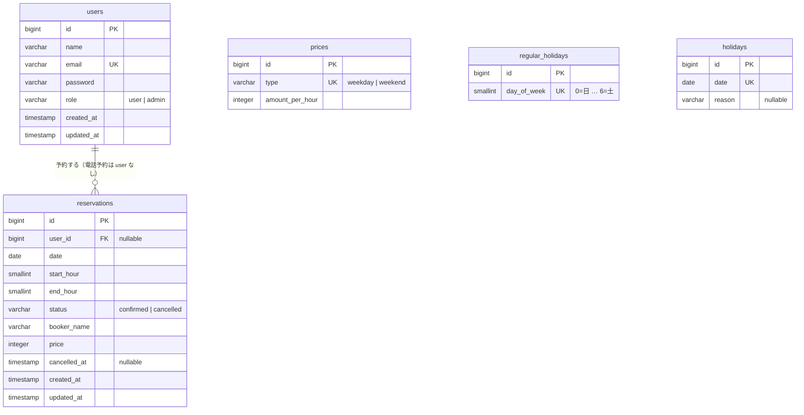

# 02. DB 設計

PostgreSQL 15。業務ルールのうち **「同時に来ても破れてはいけないもの」は DB 制約で守る**。アプリ側のチェックは、ユーザーにわかりやすいエラーを返すためのもの、という位置づけ。

## ER 図



`password_reset_tokens`, `sessions`, `cache`, `jobs` など Laravel 標準のテーブルは省略。

## テーブル定義

### users

| カラム | 型 | 制約 | 備考 |
|---|---|---|---|
| id | bigint | PK | |
| name | varchar(20) | NOT NULL | R1 は varchar(255)。入力ルール（20文字）に合わせる |
| email | varchar(255) | NOT NULL, UNIQUE | |
| email_verified_at | timestamp | NULL | Laravel 標準。未使用 |
| password | varchar(255) | NOT NULL | |
| role | varchar(20) | NOT NULL, DEFAULT `'user'`, CHECK (`role IN ('user','admin')`) | `enum` 型ではなく varchar + CHECK（後述） |
| remember_token | varchar(100) | NULL | |
| created_at / updated_at | timestamp | | |

### reservations

| カラム | 型 | 制約 | 備考 |
|---|---|---|---|
| id | bigint | PK | |
| user_id | bigint | NULL, FK → users.id **ON DELETE SET NULL** | 電話予約は NULL。**【R2】** R1 は CASCADE |
| date | date | NOT NULL | 利用日 |
| start_hour | smallint | NOT NULL | 開始時（例: 10）。**【R2】** R1 は `time` 型 |
| end_hour | smallint | NOT NULL | 終了時（例: 12）。区間は `[start_hour, end_hour)` |
| status | varchar(20) | NOT NULL, DEFAULT `'confirmed'`, CHECK | `confirmed` / `cancelled` |
| booker_name | varchar(255) | NOT NULL | 予約時点の名前（電話予約は入力値） |
| price | integer | NOT NULL, CHECK (`price >= 0`) | 予約時点の合計金額 |
| cancelled_at | timestamp | NULL | **【R2】** いつキャンセルされたか。`status = 'cancelled'` と一致させる |
| created_at / updated_at | timestamp | | |

#### 制約

```sql
-- 時刻として正しいこと（営業時間や利用時間の長さなど、業務の値はここに書かない）
CHECK (start_hour >= 0 AND start_hour < end_hour AND end_hour <= 24),

-- 状態と cancelled_at の整合
CHECK ((status = 'cancelled') = (cancelled_at IS NOT NULL)),

-- 【B2】二重予約の防止: 確定済み予約どうしで、同じ日に時間帯が重なってはいけない
-- date の等値比較を gist で扱うため btree_gist 拡張が必要
EXCLUDE USING gist (
    date WITH =,
    int4range(start_hour, end_hour) WITH &&
) WHERE (status = 'confirmed'),
```

```sql
-- 【B3】1人1日1件: 会員ごとに、同じ日の確定済み予約は1件まで（電話予約は対象外）
CREATE UNIQUE INDEX reservations_user_date_confirmed_unique
    ON reservations (user_id, date)
    WHERE status = 'confirmed' AND user_id IS NOT NULL;
```

#### インデックス

| インデックス | 用途 |
|---|---|
| 排他制約の gist インデックス | 重複判定。カレンダーの期間検索（`date` 範囲）にも効く |
| `(user_id, date)` 部分ユニーク | 1人1日1件、マイページの一覧 |
| `(date)` | 古い予約の削除、管理画面の期間検索 |

#### 設計メモ

- **時刻を `smallint` の「時」で持つ理由**（D6）
  予約は正時単位しかないので、`time` 型は表現力が余っていた。R1 は `"10:00:00"` を `substr` で切り出していて、比較・計算のたびに文字列処理が必要だった。整数にすると範囲チェックと `int4range` による重複判定を素直に書ける。API で返すときは Resource で `"10:00"` 形式にも変換する。
- **排他制約（`EXCLUDE`）を使う理由**（B2）
  「重なる予約が無いか確認 → 作成」の間に別リクエストが割り込むと二重予約になる。行ロックで防ぐ方法もあるが、「まだ存在しない行」はロックできないので、テーブルロックかアドバイザリロックが要る。排他制約なら DB が原子的に保証し、違反時は SQLSTATE `23P01` になるので、それを「その時間帯はすでに予約済みです」に変換するだけでよい。
- **DB に書く制約の線引き**（2026-09-29 決定）
  - **書く**: 同時アクセスで破れるルール（二重予約・1人1日1件）と、値が変わらない性質（時刻が 0〜24、開始 < 終了、金額 ≥ 0、状態と `cancelled_at` の整合）
  - **書かない**: 管理者や設定で変わりうる業務の値（営業時間 10〜22、利用時間 2〜4 時間）。これらは `config/facility.php` の1か所だけに置き（D1）、`BookingRules` で検査する。予約の書き込みはすべて `CreateReservation` を通るので、アプリのチェックで守れる
- **`enum` 型でなく varchar + CHECK にする理由**
  PostgreSQL の Laravel `enum()` は実際には varchar + CHECK を作るので中身は同じ。アプリ内での値の定義は PHP の backed enum（`App\Enums\*`）が正。
  ただし **マイグレーションには値を直接書く**（`App\Enums` を参照しない）。マイグレーションは「その時点の DB の形」を記録するものなので、後で Enum に値を足したときに過去のマイグレーションの意味が変わってしまうのを避ける。値を足すときは新しいマイグレーションで CHECK を張り替える
- **`cancelled_at` を足す理由**
  キャンセルが「いつ」行われたかを後から確認できるようにするため（直前キャンセルが多いか、など）。画面では使わない。

### prices

| カラム | 型 | 制約 | 備考 |
|---|---|---|---|
| id | bigint | PK | |
| type | varchar(20) | NOT NULL, UNIQUE, CHECK (`type IN ('weekday','weekend')`) | |
| amount_per_hour | integer | NOT NULL, CHECK (`amount_per_hour >= 0`) | 円 |
| created_at / updated_at | timestamp | | |

2行固定（シーダーで作る）。行が無い状態で予約が作られないよう、料金取得時に行が無ければ例外にする（R1 は `null * 時間 = 0円` で予約できてしまう）。

### regular_holidays

| カラム | 型 | 制約 | 備考 |
|---|---|---|---|
| id | bigint | PK | |
| day_of_week | smallint | NOT NULL, UNIQUE, CHECK (`day_of_week BETWEEN 0 AND 6`) | 0 = 日曜（Carbon の `dayOfWeek` と同じ） |
| created_at / updated_at | timestamp | | |

更新は「全削除 → 選ばれた曜日を挿入」を1トランザクションで行う（R1 は `truncate()` → 1件ずつ `create()` で、途中で失敗すると定休日が消えたままになった）。`truncate` はテーブルロックを取るので `delete()` を使う。

### holidays

| カラム | 型 | 制約 | 備考 |
|---|---|---|---|
| id | bigint | PK | |
| date | date | NOT NULL, UNIQUE | |
| reason | varchar(255) | NULL | |
| created_at / updated_at | timestamp | | |

## マイグレーション方針

- 新規作成なので、R1 の差分マイグレーションは引き継がず、テーブルごとに1ファイルで作る
- `CREATE EXTENSION IF NOT EXISTS btree_gist;` を reservations より前のマイグレーションで実行する
- 排他制約・部分インデックス・CHECK は Schema Builder で書けないので `DB::statement()` を使う
- テストも PostgreSQL で実行する（SQLite では排他制約が再現できない）→ [06-testing.md](06-testing.md)

## シーダー

| シーダー | 内容 | 実行する環境 |
|---|---|---|
| `InitialDataSeeder` | 管理者（`ADMIN_EMAIL` / `ADMIN_PASSWORD`）、料金2行、定休日（月曜） | 全環境 |
| `DemoDataSeeder` **【R2】** | デモ会員数名と、今後2週間分の予約 | ローカル・本番デモ |

管理者のメール・パスワードは `env()` ではなく `config('facility.admin.*')` 経由で読む（`config:cache` 後に `env()` が `null` になるため）。
